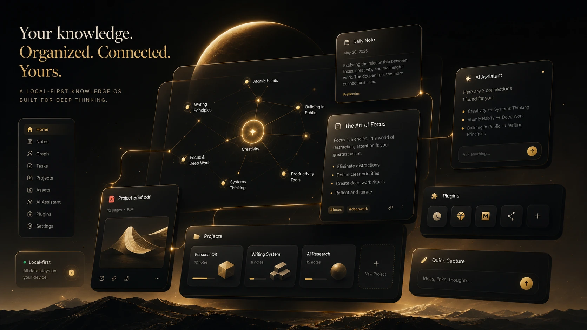
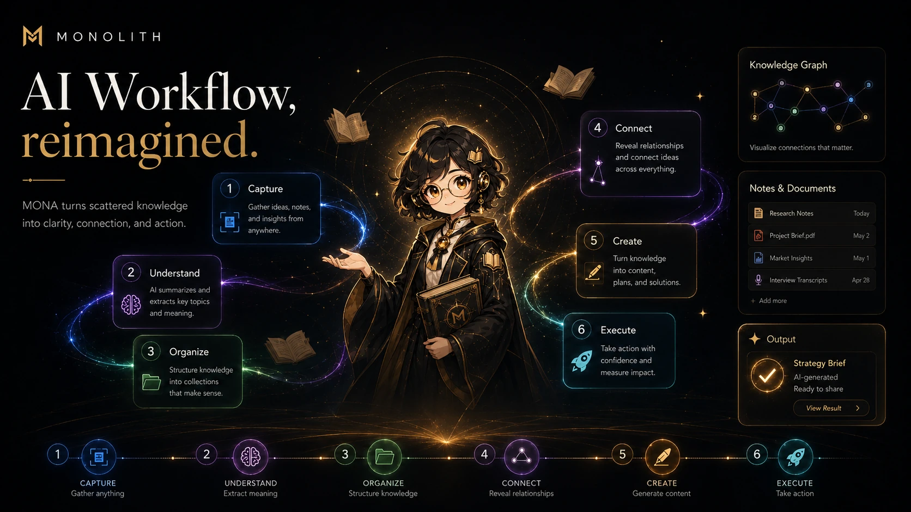
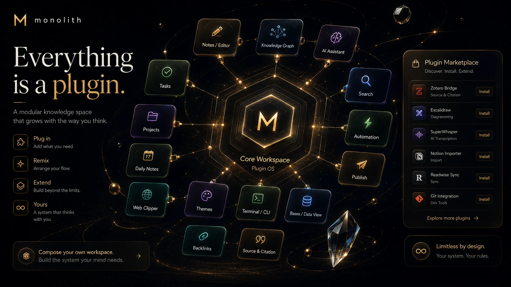
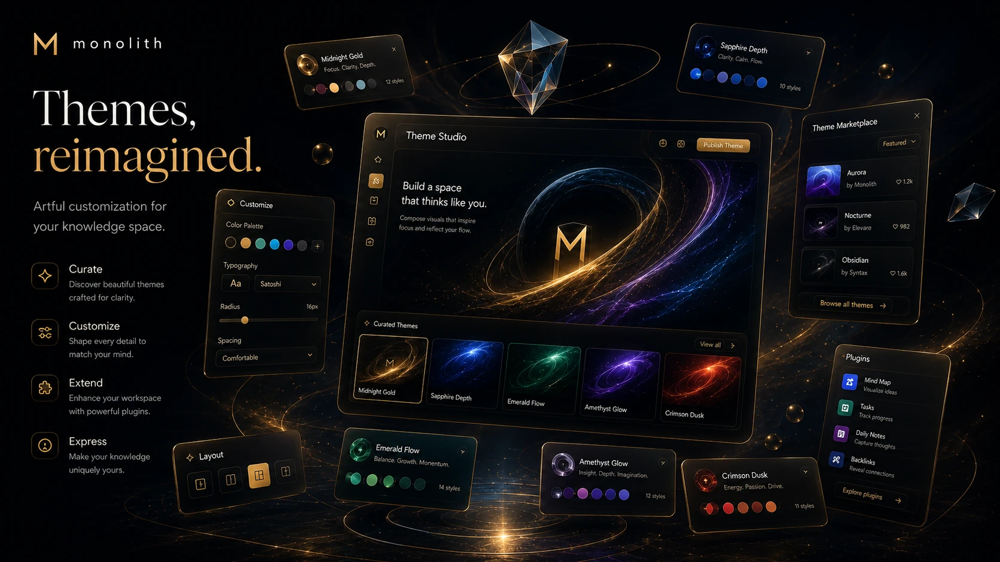

<div align="center">

#  Monolith

### 本地优先的知识操作系统

**让知识不再沉睡，让思想自然生长**

[](https://github.com/houbb/monolith-landpage/releases/latest)
[](https://github.com/houbb/monolith)
[](https://github.com/houbb/monolith)

</div>

---

> 笔记、图谱、AI 与插件融为一体。20MB 极致轻量，数据完全在本地，你的知识，你做主。

## ✨ 产品全景

<p align="center">
  
</p>

<p align="center"><em>知识图谱、AI 助手、笔记编辑、插件生态，一切融为一体</em></p>

---

## 🧠 AI 原生架构

<p align="center">
  
</p>

**AI 不是功能 — 而是基石。** 从上下文感知到多步推理，Monolith 重新定义了 AI 与知识的共生方式。

| 全局感知 | 多步推理 | 人为主导 |
|:---:|:---:|:---:|
| AI 理解你的整个知识库 | 规划、执行、验证——自主完成任务链路 | 你决定何时、如何使用 AI，每一步透明可控 |

---

## 🧩 插件生态

<p align="center">
  
</p>

**万物皆是插件，具有无限可能。** 从 SQL 查询到 HTTP 请求，从代码执行到自定义 UI。

- 🔌 **开放架构** — 标准化插件 API，完整生命周期管理
- ⚡ **运行时块** — SQL、HTTP、Python、JavaScript，在笔记内直接执行代码
- 🏪 **社区市场** — 浏览分享社区插件，或几分钟打造你自己的
- 🎨 **主题定制** — 30+ 精心打磨的主题，也可以用 CSS Snippet 打造专属外观

---

## 🎨 主题定制

<p align="center">
  
</p>

**你的知识花园，自当五彩缤纷。** 从深邃金到极光紫，从森林绿到玫瑰红，每一套都经过精心打磨。

---

## 🚀 核心能力

<table>
<tr>
<td width="50%">

### 📦 本地优先，极速安装
数据完全存储在本地，无需联网即可使用。安装包仅 **20MB**，开箱即用。

```
Monolith  ████░░░░░░  20MB   (极小)
Obsidian  ██████████  ~80MB  
Notion    ████████████████████████████  ~250MB
```

</td>
<td width="50%">

### 🕸️ 知识图谱
可视化知识关联，发现隐藏联系，构建你的思维网络。全局图谱 + 局部图谱双视角。

</td>
</tr>
<tr>
<td width="50%">

### 🔗 双向链接
自动追踪引用关系，反向链接一览无余，让知识自然生长。

</td>
<td width="50%">

### 🔍 语义检索
向量检索 + 关键词混合搜索，找到你忘了你记得的。

</td>
</tr>
<tr>
<td width="50%">

### 📊 13 种语言代码图谱
代码结构可视化，依赖关系一目了然。

</td>
<td width="50%">

### 🔀 Git 原生集成
分支管理、提交历史、储藏，无需社区插件，开箱即用。

</td>
</tr>
</table>

---

## 💎 设计理念

> **Monolith，取自"永恒之石"。** 知识如刻石般永存。我们相信工具应该安静地服务用户，而不是喧宾夺主。

| 原则 | 说明 |
|:---:|:---|
| 🏠 本地优先 | 所有数据存储在本地，无需联网，完全掌控知识资产 |
| 📝 纯文本驱动 | 笔记即 Markdown 文件，无锁定、无黑盒，随时可迁移、可备份 |
| 🧊 核心极简 | 内核只做最基础的事，高级能力通过插件按需加载 |
| 🍎 Apple 风格 UI | 毛玻璃标题栏、圆角卡片、平滑动画，每个像素都经得起凝视 |

---

## 📥 立即下载

免费、开源、本地优先。选择适合你操作系统的版本：

| 平台 | 说明 |
|:---:|:---|
| 🪟 **Windows** | 适用于 Windows 10 及以上 |
| 🍎 **macOS** | 适用于 macOS 12 及以上 |
| 🐧 **Linux** | 适用于 Ubuntu 20.04 及以上 |

👉 **[前往下载页](https://github.com/houbb/monolith-landpage/releases/latest)**

---

## 🤝 加入社区

| 渠道 | 说明 |
|:---:|:---|
| 💬 [微信交流群](mailto:houbinbin.echo@gmail.com) | 扫码加入微信交流群 |
| 🐛 [GitHub Issues](https://github.com/houbb/monolith-landpage/issues) | 提交 Bug、功能建议 |
| 📧 [邮件联系](mailto:houbinbin.echo@gmail.com) | 商业合作、技术支持 |

---

<div align="center">

**Built for local-first knowledge workers.**

[⬆ 回到顶部](#-monolith)

</div>
